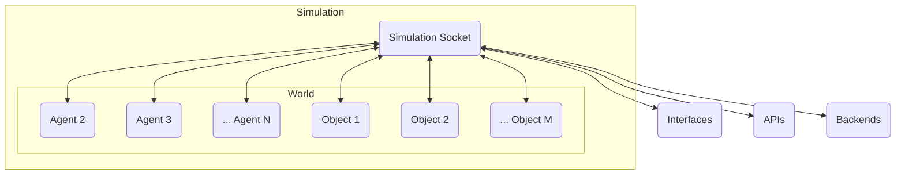

# Introduction

GenWorlds est un framework open source qui vous permet de créer des agents autonomes riches en fonctionnalités qui interagissent les uns avec les autres et avec leur environnement de manière complexe. La logique décisionnelle et les comportements de ces agents vous permettent de créer des mondes productifs pouvant atteindre de vrais objectifs.

Les agents interagissent avec le monde et avec les objets du monde, et ces interactions sont encapsulées sous forme d'événements. Ces événements sont communiqués via des sockets, permettant une interaction en temps réel entre les agents et entre les agents et l'environnement.

Dans cette documentation, nous allons approfondir chacun de ces composants clés, comment ils sont interdépendants, et fournir des exemples pour vous guider dans la compréhension et l'exploitation de la puissance de GenWorlds pour vos projets.

## Principaux avantages

- **Système multi-agents flexible:** GenWorlds fournit une plate-forme pour assembler des systèmes multi-agents complexes et interactifs. Chaque agent utilise un « cerveau » spécialisé ou `Brain`, qui lui permet d'interagir dynamiquement avec d'autres agents et l'environnement. L'architecture de GenWorlds prend en charge l'interopérabilité et la composabilité, permettant la coordination de tâches complexes. Pour approfondir la structure et les fonctionnalités, reportez-vous à la [documentation du framework GenWorlds](/docs/category/the-genworlds-framework).

- **Environnements simulés personnalisés et robustes:** GenWorlds permet la conception et la construction de divers mondes simulés, peuplés d'agents et d'objets uniques. La boîte à outils (ou framework) communautaire GenWorlds sert d'ensemble d'outils par défaut pour créer et maintenir ces simulations, masquant la complexité avec une interface intuitive. Cette boîte à outils est idéale pour prototyper divers scénarios, tester de nouvelles fonctionnalités ou concevoir des mondes complexes. [documentation de la boîte à outils](/docs/category/community-toolkit).

- **Opportunités de monétisation:** GenWorlds offre aux développeurs la possibilité de tirer un avantage économique de leur créativité. Qu'il s'agisse de vendre des agents IA uniques ou des configurations mondiales, ou d'offrir un accès aux services sur la base d'un abonnement, la plateforme fournit un mécanisme sécurisé pour les transactions. Avec GenWorlds, vous pouvez générer des revenus à partir de votre travail, tout en contribuant à une communauté croissante et diversifiée de passionnés et de professionnels de l'IA. Pour en savoir plus sur les avantages de [La plateforme GenWorlds ici](/docs/category/the-genworlds-platform).

## Concepts clés et terminologie

Avant de plonger dans les détails, il est crucial de comprendre les concepts clés qui sous-tendent GenWorlds:

- [**Simulation:**](/docs/genworlds-framework/simulation.md) est la construction unificatrice qui intègre un monde, des agents et des objets dans un environnement interactif complet. Sa caractéristique unique est le "Simulation Socket", un hub de communication central pour l'échange de données.

- [**World:**](/docs/genworlds-framework/world.md) (ou 'Monde') est l'endroit où se passe l'action, où les agents écoutent, où l'on trouve des objets et des attributs spécifiques à ce monde. Il fournit aux agents des mises à jour en temps réel sur l'état du monde, les entités à proximité et les événements, facilitant les interactions.

- [**Objects:**](/docs/genworlds-framework/objects.md) (ou 'Objets') sont les éléments interactifs essentiels, chacun défini par des ensembles d'événements uniques. Ils peuvent exister à proximité ou dans l'inventaire d'un agent, élargissant les possibilités d'interaction.

- [**Agents:**](/docs/genworlds-framework/agents/agents.md) Entités autonomes axées sur les objectifs, élaborant des stratégies d'actions pour interagir avec le monde. Ils apprennent dynamiquement sur l'environnement, en utilisant les objets qui les entourent pour atteindre leurs objectifs.

Voici un aperçu visuel :

## Exemples

La meilleure façon de comprendre le framework GenWorlds est de le voir en action. Les exemples suivants vous donneront un avant-goût de ce que vous pouvez réaliser avec GenWorlds.

- [Tour de table (RoundTable)](https://replit.com/@yeagerai/GenWorlds?v=1) Un exemple de système multi-agents, où les agents interagissent les uns avec les autres en parlant à travers un microphone, représenté par un jeton ou "token" pour communiquer et signaler aux autres agents dont c'est le tour d'effectuer une action.
